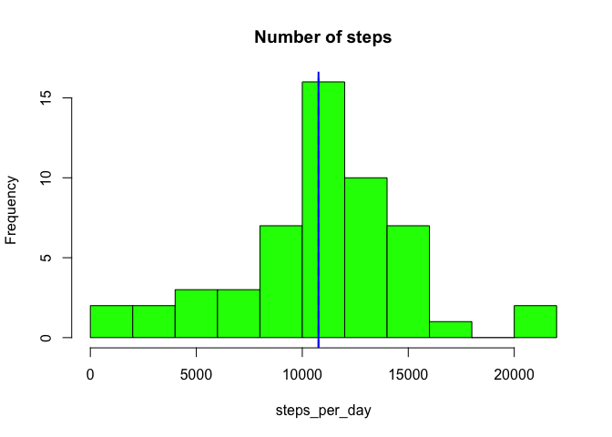
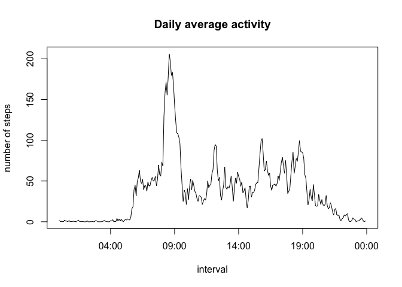
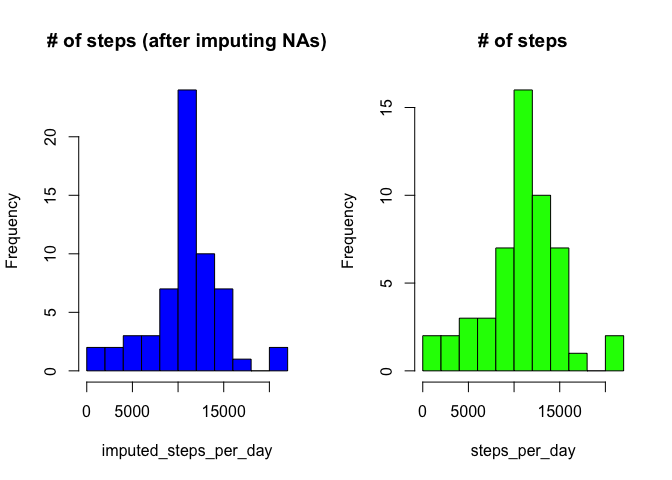
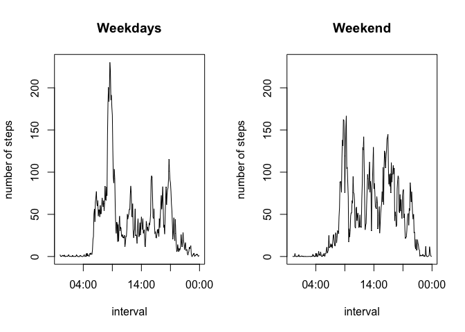

# Reproducible Research: Peer Assessment 1
Kevin Siswandi  
4 August 2015  

## Loading and preprocessing the data
  
The dataset (activity.csv) is included in this repository and can be downloaded from  
https://d396qusza40orc.cloudfront.net/repdata%2Fdata%2Factivity.zip  

In this section, we load and take a quick peek at the data.  


```r
activity <- read.csv("activity.csv")
```


```r
head(activity)
```

```
##   steps       date interval
## 1    NA 2012-10-01        0
## 2    NA 2012-10-01        5
## 3    NA 2012-10-01       10
## 4    NA 2012-10-01       15
## 5    NA 2012-10-01       20
## 6    NA 2012-10-01       25
```

```r
tail(activity)
```

```
##       steps       date interval
## 17563    NA 2012-11-30     2330
## 17564    NA 2012-11-30     2335
## 17565    NA 2012-11-30     2340
## 17566    NA 2012-11-30     2345
## 17567    NA 2012-11-30     2350
## 17568    NA 2012-11-30     2355
```

```r
summary(activity)
```

```
##      steps                date          interval     
##  Min.   :  0.00   2012-10-01:  288   Min.   :   0.0  
##  1st Qu.:  0.00   2012-10-02:  288   1st Qu.: 588.8  
##  Median :  0.00   2012-10-03:  288   Median :1177.5  
##  Mean   : 37.38   2012-10-04:  288   Mean   :1177.5  
##  3rd Qu.: 12.00   2012-10-05:  288   3rd Qu.:1766.2  
##  Max.   :806.00   2012-10-06:  288   Max.   :2355.0  
##  NA's   :2304     (Other)   :15840
```

The *interval* variable is recorded in the format of hours followed by minutes. For example, 55 refers to 00:55 (zero hours and 55 minutes) and 100 refers to 01:00 (one hour and zero minutes). We'll preprocess this variable as needed in the subsequent sections.  


## What is mean total number of steps taken per day?
  
First of all, let's calculate the total number of steps for each day. There are missing values on some days, but let's ignore that for now.  


```r
steps_per_day <- sapply(split(activity, activity$date), function(x) (sum(x[, 1])))
```

*steps_per_day* contains the total number of steps each day over the two months period. From this variable, we can directly compute the mean and median and plot a histogram:  


```r
steps_mean <- mean(steps_per_day, na.rm = TRUE); steps_mean
```

```
## [1] 10766.19
```

```r
steps_median <- median(steps_per_day, na.rm = TRUE); steps_median
```

```
## [1] 10765
```

```r
hist(steps_per_day, main = "Number of steps", breaks = 10, col = "green")
abline(v = steps_mean, col = "red", lwd = 2, lty = 2)
abline(v = steps_median, col = "blue", lwd = 2)
```

 

As we can see in the figure above, the mean and the median are very close together.  


## What is the average daily activity pattern?

In this section, we examine the average daily activity within the two months period.


```r
#Split activity by interval
s <- split(activity, activity$interval) 

#Take the daily average of steps for each interval
daily_average <- sapply(s, function(x) (mean(x[,1], na.rm = TRUE)))

#Convert the intervals to POSIXct time variables
interval <- strptime(sprintf("%04d", unique(activity$interval)), format = "%H%M")
```

The object *daily_average* contains the daily average activity pattern for each interval. The interval with maximum number of steps:


```r
max_step <- which.max(daily_average)

daily_average[max_step]
```

```
##      835 
## 206.1698
```

The maximum number of steps happens at 835 and has the value of 206.1698113. Here's a time-series plot of the (daily average) number of steps taken at each interval:  


```r
plot(interval, daily_average, type = "l", ylab = "number of steps", main = "Daily average activity")
```

 

As evident from the plot, the maximum number of steps is around 08:35, which is consistent with our *which.max* result above.  


## Imputing missing values

We'll now deal with the missing values as they may introduce bias into our calculations. Let's take a look again at the summary


```r
summary(activity)
```

```
##      steps                date          interval     
##  Min.   :  0.00   2012-10-01:  288   Min.   :   0.0  
##  1st Qu.:  0.00   2012-10-02:  288   1st Qu.: 588.8  
##  Median :  0.00   2012-10-03:  288   Median :1177.5  
##  Mean   : 37.38   2012-10-04:  288   Mean   :1177.5  
##  3rd Qu.: 12.00   2012-10-05:  288   3rd Qu.:1766.2  
##  Max.   :806.00   2012-10-06:  288   Max.   :2355.0  
##  NA's   :2304     (Other)   :15840
```

There are 2304 missing values in the dataset. One reasonable strategy is to fill in every missing value with the mean for that 5-minute interval.


```r
#Filling in missing values with the daily average

counter = 1;
for (step in activity$steps) {
 five_min_inter <- activity$interval[counter]
  if(is.na(step)) {
    step1 <- daily_average[as.character(five_min_inter)]
    activity$steps[counter] <- step1
  }
  counter = counter + 1
}
```

With the missing values filled in, we can then see what difference imputing the missing values can make to the daily total number of steps:


```r
imputed_steps_per_day <- sapply(split(activity, activity$date), function(x) (sum(x[, 1])))

par(mfrow = c(1,2))
hist(imputed_steps_per_day, main = "# of steps (after imputing NAs)", breaks = 10, col = "blue")
hist(steps_per_day, main = "# of steps", breaks = 10, col = "green")
```

 

```r
steps_mean <- mean(imputed_steps_per_day); steps_mean
```

```
## [1] 10766.19
```

```r
steps_median <- median(imputed_steps_per_day); steps_median
```

```
## [1] 10766.19
```

Imputing the missing values with the mean for the respective interval does not change the shape of the distribution of the total number of steps per day, but rather it just ramps up the average, making the median equals the mean in the process.

## Are there differences in activity patterns between weekdays and weekends?

In this section, we use the dataset with the missing values filled in.


```r
#New dataset with a factor variable indicating whether the date is a weekday/weekend
Sys.setlocale("LC_TIME", "en_US.UTF-8")
```

```
## [1] "en_US.UTF-8"
```

```r
activity$day <- weekdays(as.Date(activity$date))


week_days <- c("Monday", "Tuesday", "Wednesday", "Thursday", "Friday")
week_end <- c("Saturday", "Sunday")


##Subset weekdays and do the same as before
activity_weekdays <- subset(activity, day %in% week_days)

s_weekdays <- split(activity_weekdays, activity_weekdays$interval) 

daily_average_weekdays <- sapply(s_weekdays, function(x) (mean(x[,1], na.rm = TRUE)))

interval_weekdays <- strptime(sprintf("%04d", unique(activity_weekdays$interval)), format = "%H%M")


#Subset weekends and do the same as before
activity_weekend <- subset(activity, day %in% week_end)

s_weekend <- split(activity_weekend, activity_weekend$interval) 

daily_average_weekend <- sapply(s_weekend, function(x) (mean(x[,1], na.rm = TRUE)))

interval_weekend <- strptime(sprintf("%04d", unique(activity_weekend$interval)), format = "%H%M")


#Plotting the data
rng <- range(daily_average_weekdays, daily_average_weekend)
par(mfrow = c(1, 2))
plot(interval_weekdays, daily_average_weekdays, type = "l", xlab = "interval", ylab = "number of steps", main = "Weekdays", ylim = rng)

plot(interval_weekend, daily_average_weekend, type = "l", xlab = "interval", ylab = "number of steps", main = "Weekend", ylim = rng)
```

 

There's quite a pronounced difference in activity levels on weekdays vs on weekends: On average, the number of steps seem to be higher in the weekends!
